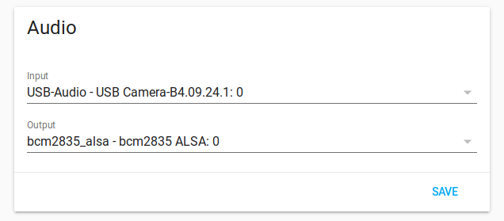

# Installation

Rhasspy should run in a variety of software environments, including:

* Within a [Docker](https://www.docker.com/) container
* As a [Hass.IO add-on](https://www.home-assistant.io/addons/)
* Inside a [Python virtual environment](https://docs.python-guide.org/dev/virtualenvs/)

### Docker

The easiest way to try Rhasspy is with Docker. To get started, make sure you have [Docker installed](https://docs.docker.com/install/):

    curl -sSL https://get.docker.com | sh
    
and that your user is part of the `docker` group:

    sudo usermod -a -G docker $USER
    
**Be sure to reboot** after adding yourself to the `docker` group!

Next, start the [Rhasspy Docker image](https://hub.docker.com/r/synesthesiam/rhasspy-server) in the background:

    docker run -d -p 12101:12101 \
          --restart unless-stopped \
          -v "$HOME/.config/rhasspy/profiles:/profiles" \
          --device /dev/snd:/dev/snd \
          synesthesiam/rhasspy-server:latest \
          --user-profiles /profiles \
          --profile en
          
This will start Rhasspy with the English profile (`en`) in the background (`-d`) on port 12101 (`-p`) and give Rhasspy access to your microphone (`--device`). Any changes you make to [your profile](profiles.md) will be saved to `~/.config/rhasspy`.
          
Once it starts, Rhasspy's web interface should be accessible at [http://localhost:12101](http://localhost:12101). If something went wrong, trying running docker with `-it` instead of `-d` to see the output.

If you're using [docker compose](https://docs.docker.com/compose/), add the following to your `docker-compose.yml` file:

    rhasspy:
        image: "synesthesiam/rhasspy-server:latest"
        restart: unless-stopped
        volumes:
            - "$HOME/.config/rhasspy/profiles:/profiles"
        ports:
            - "12101:12101"
        devices:
            - "/dev/snd:/dev/snd"
        command: --user-profiles /profiles --profile en

### Hass.IO

The second easiest was to install Rhasspy is as a [Hass.IO add-on](https://www.home-assistant.io/addons/). Following the [installation instructions for Hass.IO](https://www.home-assistant.io/hassio/installation/) before proceeding.

To install the add-on, add my [Hass.IO Add-On Repository](https://github.com/synesthesiam/hassio-addons) in the Add-On Store, refresh, then install the "Rhasspy Assistant" under “Synesthesiam Hass.IO Add-Ons” (all the way at the bottom of the Add-On Store screen).

**NOTE:** Beware that on a Raspberry Pi 3, the add-on can take 10-15 minutes to build and around 1-2 minutes to start.

Watch the system log for a message like `Build 8e35c251/armhf-addon-rhasspy:2.11 done`. If the “Open Web UI” link on the add-on page doesn’t work, please check the log for errors, wait a minute, and try again.

Before starting the add-on, make sure to give it access to your microphone and speakers:

### Virtual Environment

Rhasspy can be installed into a Python virtual environment, though there are a number of requirements. This may be desirable, however, if you have trouble getting Rhasspy to access your microphone from within a Docker container. To start, clone the repo somewhere:

    git clone https://github.com/synesthesiam/rhasspy.git
    
Then run the `download-dependencies.sh` and `create-venv.sh` scripts (assumes a Debian distribution):

    cd rhasspy/
    ./download-dependencies.sh
    ./create-venv.sh
    
Once the installation finishes (5-10 minutes on a Raspberry Pi 3), you can use the `run-venv.sh` script to start Rhasspy:

    ./run-venv.sh --profile en
    
If all is well, the web interface will be available at [http://localhost:12101](http://localhost:12101)

### Software Requirements

At its core, Rhasspy requires:

* Linux
* Python 3.6
* [Flask](https://pypi.org/project/Flask/) web server, including
    * [flask-swagger-ui](https://pypi.org/project/flask-swagger-ui/) for HTTP API documentation
    * [Flask-Cors](https://pypi.org/project/Flask-Cors/) for [CORS](https://developer.mozilla.org/en-US/docs/Web/HTTP/CORS) stuff
    * [Flask-Sockets](https://pypi.org/project/Flask-Sockets/) for websocket support
* [pydash](https://pypi.org/project/pydash/) utility library

To actually use any components, however, requires a lot of [extra software](about.md#supporting-tools).
