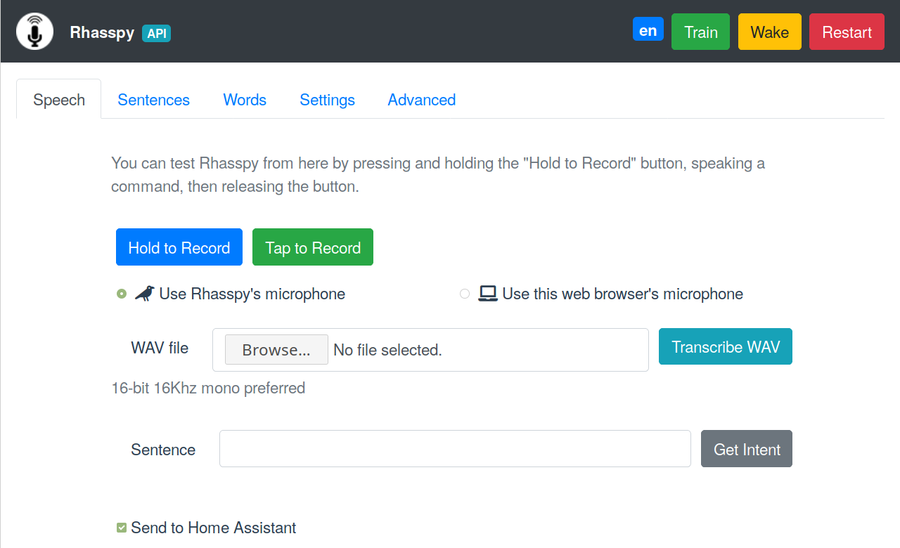
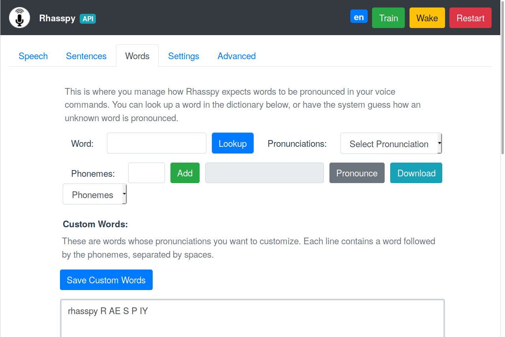
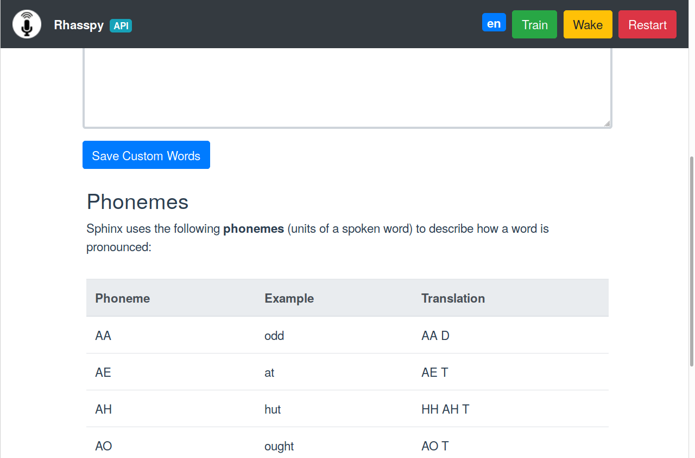
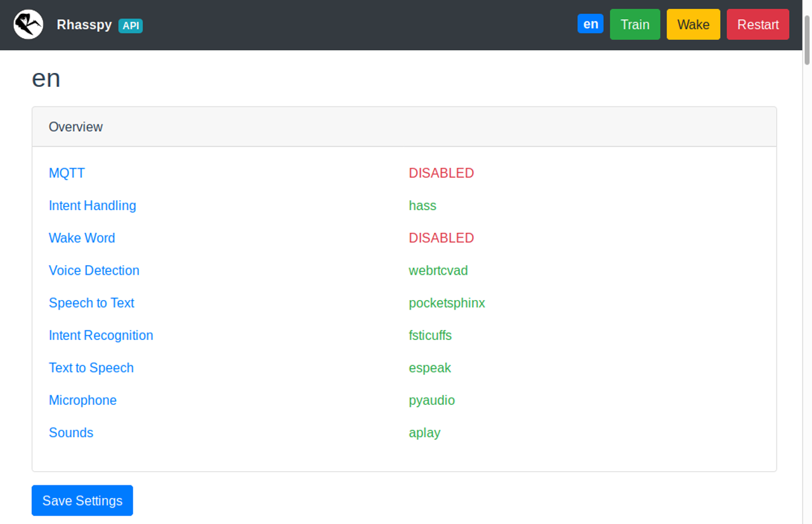
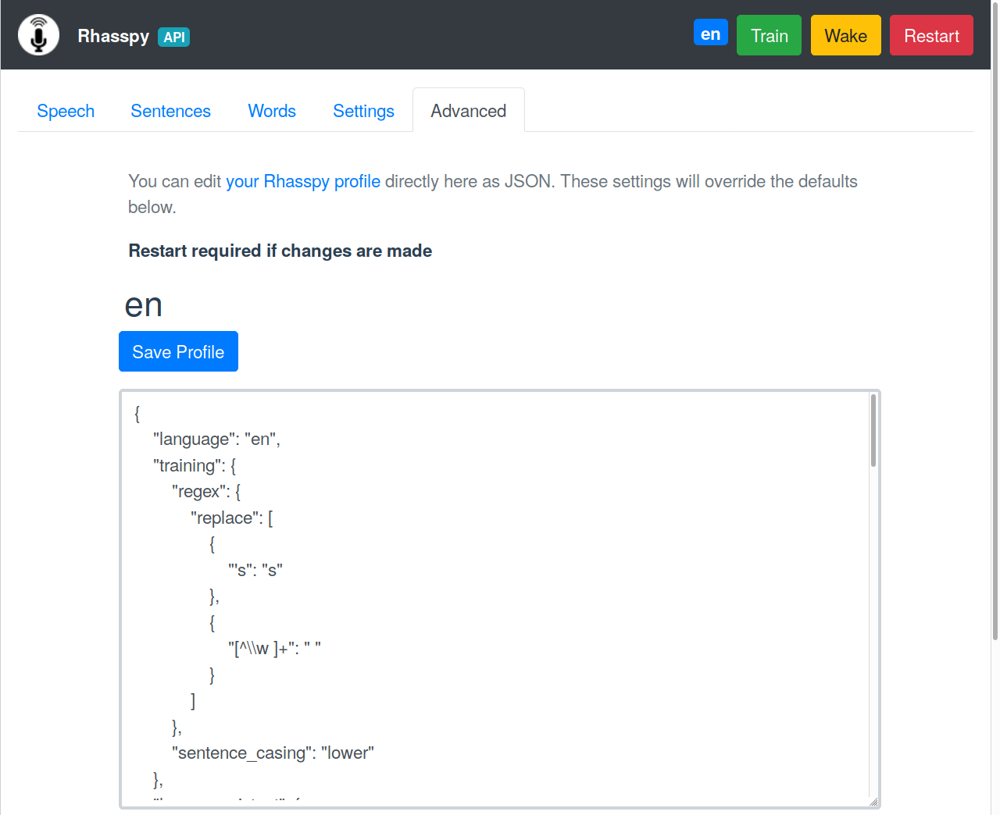
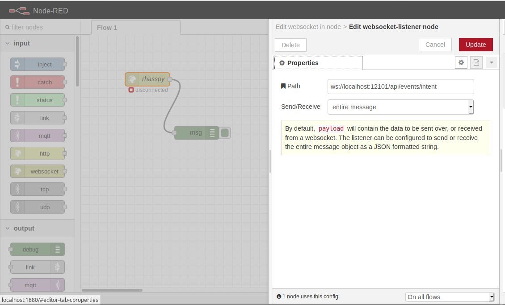

# Usage

You can interact with Rhasspy in different ways besides just your voice. Rhasspy includes a [web interface](#web-inteface), typically hosted on port 12101. There is also an [HTTP API](#http-api) that lets you programmatically manipulate Rhasspy from external programs or services. A [command-line interface](#command-line) is available as well to allow for Rhasspy to be easily included in shell scripts. Lastly, Rhasspy subscribes and publishes to specific [MQTT topics](#mqtt) in accordance with (a portion of) the [Hermes protocol](https://docs.snips.ai/ressources/hermes-protocol).

## Web Interface

A browser-based interface for Rhasspy is available on port 12101 by default ([http://localhost:12101](http://localhost:12101) if running locally). From this interface, you can test voice commands, add new voice commands, re-train, and edit your profile.

### Speech Tab

Test voice and text commands.



* Record a voice command with `Hold to Record` or `Tap to Record`
* Upload a WAV file with a voice command
* Enter a text command and execute it
* Uncheck `Send to Home Assistant` if you **don't** want Rhasspy to send events to Home Assistant

### Sentences Tab

Add new voice commands to Rhasspy.


See documentation on [sentences.ini](training.md#sentencesini) for more information.
Make sure to re-train after saving!

### Words Tab

Teach Rhasspy how to pronounce new words.



* Look up pronunciation(s) for known words (in your profile's `base_dictionary.txt` file)
* Have Rhasspy guess how to pronounce a new (unknown) word
* Pronounce the current word or download a WAV file of it
* Add new words to your `custom_words.txt` file
* Shows words that Rhasspy doesn't know (when training fails)



Table of examples for each phoneme in your profile language.
Use this when constructing pronunciations for custom words.

### Settings Tab

Simplified interface for editing your [profile](profiles.md).
Make sure to restart Rhasspy after saving changes.



### Advanced Tab

Direct interface for editing your [profile](profiles.md).
**Be careful!** Entering invalid settings here can cause Rhasspy to not start.



## HTTP API

Rhasspy features a comprehensive HTTP API available at `/api`, documented with [OpenAPI 3](https://github.com/OAI/OpenAPI-Specification) (Swagger). Some notable endpoints are:

* `/api/profile`
    * GET the JSON for your profile, or POST to overwrite it
* `/api/listen-for-command`
    * POST to wake Rhasspy up and start listening for a voice command
* `/api/start-recording`
    * POST to have Rhasspy start recording a voice command
* `/api/stop-recording`
    * POST to have Rhasspy stop recording and process recorded data as a voice command
* `/api/train`
    * POST to re-train your profile
* `/api/speech-to-intent`
    * POST a WAV file and have Rhasspy process it as a voice command
* `/api/text-to-intent`
    * POST text and have Rhasspy process it as command
* `/api/text-to-speech`
    * POST text and have Rhasspy speak it
    
See `public/swagger.yaml` in Rhasspy's repository for all available endpoints, or visit `/api` on your Rhasspy web server (e.g., [http://locahost:12101/api](http://localhost:12101/api)).

## Secure Hosting with HTTPS

If you need to access Rhasspy's web interface/API through HTTPS (formally SSL), you can provide a certificate and key file via command-line parameters or the Hass.IO configuration.

If you're running Rhasspy via Docker or in a virtual environment, add `--ssl <CERT_FILE> <KEY_FILE>` to the command-line arguments where `<CERT_FILE>` is your SSL certificate and `<KEY_FILE>` is your SSL key file.

You can generate a self-signed certificate with the following command:

    openssl req -x509 -newkey rsa:4096 -nodes -out cert.pem -keyout key.pem -days 365
    
After answering the series of questions, you should have `cert.pem` and `key.pem` in your current directory. Then run Rhasspy with:

    <RHASSPY COMMAND> --ssl cert.pem key.pem
    
The web interface will now be available at [https://localhost:12101](https://locahost:12101) and the web socket events at `wss://localhost:12101/api/events/intent`

In Hass.IO, you will need to set the following options via the web interface or in your JSON configuration:

  * `ssl`: `true`
  * `certfile`: `cert.pem`
  * `keyfile`: `key.pem`

## WebSocket Events

Whenever a voice command is recognized, Rhasspy emits JSON events over a websocket connection available at `ws://rhasspy:12101/api/events/intent` (replace `ws://` with `wss://` if you're using [secure hosting](usage.md#secure-hosting-with-https)).
You can listen to these events in a [Node-RED](https://nodered.org) flow, and easily add offline, private voice commands to your home automation set up!

For the `ChangLightState` intent from the [RGB Light Example](index.md#rgb-light-example), Rhasspy will emit a JSON event like this over the websocket:

```json
{
  "text": "set the bedroom light to red",
  "intent": {
    "name": "ChangeLightColor",
    "confidence": 1
  },
  "entities": [
    {
      "entity": "name",
      "value": "bedroom"
    },
    {
      "entity": "color",
      "value": "red"
    }
  ],
  "slots": {
    "name": "bedroom",
    "color": "red"
  }
}
```

## Home Assistant

Rhasspy communicates with Home Assistant directly over its [REST API](https://developers.home-assistant.io/docs/en/external_api_rest.html).
Specifically, Rhasspy intents are POST-ed to the [events endpoint](https://developers.home-assistant.io/docs/en/external_api_rest.html#post-api-events-lt-event_type).

If you have a Rhasspy intent named `ChangeLightColor` with `name` and `color` slots like in the [RGB light example](index.md#rgb-light-example), then Home Assistant will receive an event of type `rhasspy_ChangeLightColor` whose event data is:

```json
{
  "name": "bedroom",
  "color": "red"
}
```

when you say "set the bedroom to red". You should write a custom [automation with an event trigger](https://www.home-assistant.io/docs/automation/trigger/#event-trigger) to do something when this event arrives. Catching the example event would look like:

```yaml
automation:
  trigger:
    platform: event
    event_type: rhasspy_ChangeLightColor
    event_data:
      color: red
  action:
    ...
```

You've now added offline, private voice commands to your Home Assistant. Happy automating!

## Node-RED

Rhasspy can interact directly with [Node-RED](https://nodered.org) directly through [websockets](usage.md#websocket-events).
Simply add a websocket input and set the path to `ws://<rhasspy>:12101/api/events/intent` where `<rhasspy>` is the hostname or IP address of your Rhasspy server.
Make sure to also set send/receive to "entire message".



More example flows are available [on Github](https://github.com/synesthesiam/rhasspy/tree/master/examples/nodered).

## Command Line

You can access portions of Rhasspy's functionality without running a web server through the command-line interface.
The `rhasspy` Python module runs this interface in its `__main__`, so it's accessible from Rhasspy's source code directory by running:

    python3 -m rhasspy <COMMAND> <ARGUMENTS>
    
This will only work inside a properly set up [virtual environment](installation.md#virtual-environment), however.
If you run Rhasspy through [Docker](installation.md#docker), the [rhasspy-cli](https://github.com/synesthesiam/rhasspy/blob/master/bin/rhasspy-cli) script should be used instead:

    wget https://github.com/synesthesiam/rhasspy/blob/master/bin/rhasspy-cli
    chmod +x rhasspy-cli
    ./rhasspy-cli --help
    
Put this script in your `~/bin` directory so that you can refer to it as `rhasspy-cli` from any directory.
By default, it will look for profiles in `$XDG_CONFIG_FILE/rhasspy/profiles`, which is probably `~/.config/rhasspy/profiles` (see [XDG specification](https://specifications.freedesktop.org/basedir-spec/basedir-spec-latest.html) for more information).
    
**Beware**: the `rhasspy-cli` script run under your user accout and grants Rhasspy **write access to your home directory**.
This is needed to save files during the training process, and to avoid those files being owned by `root`.
The [rhasspy-cli-ro](https://github.com/synesthesiam/rhasspy/blob/master/bin/rhasspy-cli-ro) script can be used for read only operations, such as speech to text or intent handling, but cannot make any changes to your file system.

### Top-Level Arguments

The `rhasspy-cli` script takes a command and a set of arguments:

    rhasspy-cli --profile <PROFILE_NAME> <COMMAND> <ARGUMENTS>
    
Adding `--debug` before the command will print additional information to the console:

    rhasspy-cli --debug --profile <PROFILE_NAME> <COMMAND> <ARGUMENTS>
    
You can override profile settings with `--set` like this:

    rhasspy-cli --profile <PROFILE_NAME> --set <SETTING_NAME> <SETTING_VALUE> ... <COMMAND> <ARGUMENTS>
    
### Available Commands

For `rhasspy-cli --profile <PROFILE_NAME> <COMMAND> <ARGUMENTS>`, `<COMMAND>` can be:

* `info`
    * Print profile JSON to standard out
    * Add `--defaults` to only print settings from `defaults.json`
* `wav2text`
    * Convert WAV file(s) to text
* `wav2intent`
    * Convert WAV file(s) to intent JSON
    * Add `--handle` to have Rhasspy send events to Home Assistant
* `text2intent`
    * Convert text command(s) to intent JSON
    * Add `--handle` to have Rhasspy send events to Home Assistant
* `train`
    * Re-train your profile
* `mic2wav`
    * Listen for a voice command and output WAV data
    * Add `--timeout <SECONDS>` to stop recording after some number of seconds
* `mic2text`
    * Listen for a voice command and convert it to text
    * Add `--timeout <SECONDS>` to stop recording after some number of seconds
* `mic2intent`
    * Listen for a voice command output intent JSON
    * Add `--handle` to have Rhasspy send events to Home Assistant
    * Add `--timeout <SECONDS>` to stop recording after some number of seconds
* `word2phonemes`
    * Print the CMU phonemes for a word (possibly unknown)
    * Add `-n <COUNT>` to control the maximum number of guessed pronunciations
* `word2wav`
    * Pronounce a word (possibly unknown) and output WAV data
* `text2speech`
    * Speaks one or more sentences using Rhasspy's text to speech system
* `text2wav`
    * Converts a single sentence to WAV using Rhasspy's text to speech system
* `sleep`
    * Run Rhasspy and wait until wake word is spoken

### Profile Operations

Print the complete JSON for the Enlgish profile with:

    rhasspy-cli --profile en info
    
You can combine this with other commands, such as `jq` to get at specific pieces:

    rhasspy-cli info --profile en | jq .wake.pocketsphinx.keyphrase
    
Output (JSON):

    "okay rhasspy"
    
### Training

Retrain your the English profile with:

    rhasspy-cli --profile en train
    
Add `--debug` before `train` for more information.

### Speech to Text/Intent

Convert a WAV file to text from stdin:

    rhasspy-cli --profile en wav2text < what-time-is-it.wav
    
Output (text):

    what time is it
    
Convert multiple WAV files:

    rhasspy-cli --profile en wav2text what-time-is-it.wav turn-on-the-living-room-lamp.wav
    
Output (JSON)

```json
{
    "what-time-is-it.wav": "what time is it",
    "turn-on-the-living-room-lamp.wav": "turn on the living room lamp"
}
```

Convert multiple WAV file(s) to intents **and** handle them:
    
    rhasspy-cli --profile en wav2intent --handle what-time-is-it.wav turn-on-the-living-room-lamp.wav
    
Output (JSON):

```json
{
    "what_time_is_it.wav": {
        "text": "what time is it",
        "intent": {
            "name": "GetTime",
            "confidence": 1.0
        },
        "entities": []
    },
    "turn_on_living_room_lamp.wav": {
        "text": "turn on the living room lamp",
        "intent": {
            "name": "ChangeLightState",
            "confidence": 1.0
        },
        "entities": [
            {
                "entity": "state",
                "value": "on"
            },
            {
                "entity": "name",
                "value": "living room lamp"
            }
        ]
    }
}
```

### Text to Intent

Handle a command as if it was spoken:

    rhasspy-cli --profile en text2intent --handle "turn off the living room lamp"
    
Output (JSON):

```json
{
    "turn off the living room lamp": {
        "text": "turn off the living room lamp",
        "intent": {
            "name": "ChangeLightState",
            "confidence": 1.0
        },
        "entities": [
            {
                "entity": "state",
                "value": "off"
            },
            {
                "entity": "name",
                "value": "living room lamp"
            }
        ]
    }
}
```

### Record Your Voice

Save a voice command to a WAV:

    rhasspy-cli --profile en mic2wav > my-voice-command.wav
    
You can listen to it with:

    aplay my-voice-command.wav
    
### Test Your Wake Word

Start Rhasspy and wait for wake word:

    rhasspy-cli --profile en sleep
    
Should exit and print the wake word when its spoken.

### Text to Speech

Have Rhasspy speak one or more sentences:

    rhasspy-cli --profile en text2speech "We ride at dawn!"

Use a different text to speech system and voice:

    rhasspy-cli --profile en \
        --set 'text_to_speech.system' 'flite' \
        --set 'text_to_speech.flite.voice' 'slt' \
        text2speech "We ride at dawn!"

### Pronounce Words

Speak words Rhasspy doesn't know!

    rhasspy-cli --profile en word2wav raxacoricofallapatorius | aplay
    
### Text to Speech to Text to Intent

Use the miracle of Unix pipes to have Rhasspy interpret voice commands from itself:

    rhasspy-cli --profile en \
        --set 'text_to_speech.system' 'picotts' \
        text2wav "turn on the living room lamp" | \
          rhasspy-cli --profile en wav2text | \
            rhasspy-cli --profile en text2intent


Output (JSON):

```json
{
    "turn on the living room lamp": {
        "text": "turn on the living room lamp",
        "intent": {
            "name": "ChangeLightState",
            "confidence": 1.0
        },
        "entities": [
            {
                "entity": "state",
                "value": "on"
            },
            {
                "entity": "name",
                "value": "living room lamp"
            }
        ],
        "speech_confidence": 1,
        "slots": {
            "state": "on",
            "name": "living room lamp"
        }
    }
}
```
